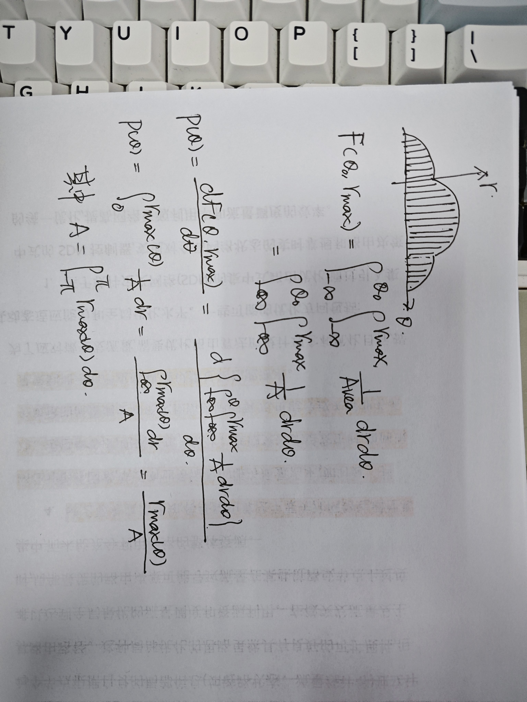

# 13 - 采样

> [!important] 这章在讲什么？
> 首先来考虑一个很现实的问题：我想在圆盘上均匀的采样某个属性的均值，怎么采？
> 一想到在圆盘上可以轻松的使用极坐标系，我们就干脆的把点表示为$(r,\theta)$
> 接下来利用加权积分就完成了：$$\bar{Attr}= \frac{\int\int_{circle}\,Attr(r,\theta)\,drd\theta}{\int\int_{circle}\,drd\theta}$$
> 但是这个式子确实有点小问题——他对 r 的采样是不公平的（但是对角度的采样是公平的）
> 来看个实际的例子就明白了，下图中我们对$r-\theta$空间中的一个矩形区域进行了均匀采样。
> 
> 当这些点转换到 XOY 空间时，它们的分布如下图所示，可以看到：距离圆心的地方分布的点非常密集，而远离圆心的地方反而没什么点分布。
> 显然，这对圆盘来说不是均匀的采样。
> 对$r$和$\theta$均匀采样无法得到在圆盘上均匀分布的采样，换言之，想要在圆盘上实现均匀采样，就必须在$r-\theta$空间上实现**不均匀采样**。
> 
> 因此本章的主题（主要目标）就呼之欲出了——我们想找到一对新的参数$\xi_1$和$\xi_2$，当我们在$\xi_1$和$\xi_2$上均匀采样时，等价于在圆盘上均匀采样。
> $$\xi_1=f_1(r,\theta)$$ > $$\xi_2=f_2(r,\theta)$$
> 在圆盘上采样随机点很抽象、也不直观，但是在$r-\theta$空间上的矩形区域上采样既直观又容易理解。复杂分布上的随机点对应到简单分布上的随机点，称为准随机点。使用准随机点计算的蒙特卡洛积分称为准蒙特卡洛积分。
>
> ---
>
> 本章给出了 3 种转换分布的方法（挑选准随机点）：逆函数法、Rejection 和 Metropolis 采样法。这里我们介绍逆函数法。
> 概率分布函数可以把变量映射到 0 到 1 的空间上。虽然变量出现各种值的机会是不均匀的，但是概率数字在 0 到 1 上是均匀的（难道说 0.99 这个数字在概率上比 0.01 更常见吗？）
> 我们利用反函数，采样概率数字，反求出变量的值。
>
> 回到一开始的示例！我想在一个圆盘中均匀采样，但是使用$r-\theta$ 2 个变量来采样肯定是不均匀的，我想找到 2 个新的变量$\xi_1-\xi_2$，使得在$\xi_1-\xi_2$空间的矩形中均匀采样，能得到在圆盘中均匀分布的点。
> 首先，点在圆盘中是均匀的，那么它的概率密度函数等于面积的倒数：
> $$f(r,\theta)=\frac{1}{\pi R^2}$$
> 接下来求 2 个变量的边缘分布函数：
> $$F(r)=F(r,\theta_{max})=\int_0^r\int_0^{2\pi}\,f(r,\theta)r\,drd\theta=\frac{r^2}{R^2}$$ > $$F(\theta)=F(r_{max},\theta)=\int_0^{\theta}\int_0^R f(r,\theta)r \,d\theta dr=\frac{\theta}{2\pi}$$
> 接下来，我们令$\xi_1-\xi_2$分别等于两个边缘分布函数：
> $$\xi_1=\frac{r^2}{R^2}$$ > $$\xi_2=\frac{\theta}{2\pi}$$
> 解出$r-\theta$：
> 
> 这意味着，我们可以在$\xi_1-\xi_2$上均匀采样，再使用上式转换出$r-\theta$的坐标，便可以在圆盘上均匀采样。
>  > 

图形中的许多应用程序需要对不寻常的空间进行“公平”采样，例如所有可能的线的空间。
例如，我们可能需要在一个像素内生成随机的边线，或者在一个像素上根据一些密度函数产生密度变化的随机样本点。
本章提供了这种概率运算的机制。这些技术对于使用蒙特卡罗积分对复杂积分进行数值计算也很有用，这也将在本章中介绍。

## 13.1 积分（整大章都没看懂。。。）

### 13.1.1 积分与度量

### 13.1.2 例子：在 2D 平面上测量直线

$$AvgLength=\frac{\int_{L\in [0,1]^2}\,length(L)d\mu(L)}{\int_{L\in [0,1]^2}\,d\mu(L)}$$
何为$\mu$的自然度量？
如果你把直线看作$y=mx+b$，那么点$(m,b)$就位于“斜率-截距”空间，一个简单的度量就是 dm 和 db。然而这不是一个好的度量方法，因为不是所有相等大小的线束都有相同的度量。更准确地说，坐标系的变化不会是不变的。
例如，如果你把所有的线都穿过正方形，那么穿过正方形的线的度量就不会和穿过一个旋转的单位正方形的度量一样，我们真正想要的是一个公平的度量方法这一概念在图 13—1 和图 13—2 中得到了说明。

> 13.1 中的两捆线应当由相同的度量，但是它们在截距上的步进不一样，所以用 db 是不公平的。
> 13.2 中，但是它们在斜率（$m=\tan{\theta}$）上的步进不一样，转角的步进才是一样的，所以用 dm 也是不公平的。

## 13.2 连续概率

## 13.3 蒙特卡洛积分

用过量的采样来近似期望的结果：

以上式子的形式有点尴尬；我们通常希望近似单个函数 g 的积分而不是乘积 fp。
$$\int_{S}g(x)dA=\frac{1}{N} \sum \frac{g(x_i)}{p(x_i)} $$
为了得到一个好的估计，我们希望尽可能多的样本，并且我们希望 g/p 具有低方差（g 和 p 应该具有相似的分布）。
智能地选择 p 函数称为重要性采样。
以上式子还显示了蒙特卡洛积分的基本问题：收益递减。由于估计的方差与 1/N 成正比，标准差与 1/√N 成正比。由于误差类似于标准偏差，我们需要 4 倍的采样才能使误差下降一半。

另一种减少方差的方法是将积分的域 S 划分为几个更小的域 Si，并将积分评估为 Si 上的积分之和。这被称为分层采样，在这种情况下，估计的方差为

图形中分层采样最常见的例子是像素采样的抖动。
函数 p 的形状对 N 个样本估计方差的影响如表 13.1 所示。注意，当 p 的形状与 g 的形状相似时，方差减小。如果 p = g/I，方差下降到零

一个重要原则是分层采样通常远远优于重要性采样
对于分层采样的方差，没有一个良好的结论说明它和抽样数之间的关系到底如何。
某些情况下分层采样运行地不是很好，比如白噪声，积分的 结果在所有区间上拥有相同的方差。
另一方面，大多数函数将从分层采样中受益，因为每个子单元的方差通常小于整个域的方差。

### 13.3.1 准蒙特卡洛积分

一种流行的求积方法是将蒙特卡罗积分中的随机点替换为准随机点。
这些点是确定性的，但在某种意义上是均匀的。例如，在单位平方面积上，一组 N 个准随机点应该在正方形内的区域 A 上具有以下属性：

例如，栅格中的一组常规样本具有此属性。

准随机点可以提高许多集成应用中的性能。有时，必须小心以确保它们不会引入混叠。
特别好的一点是，在那些需要随机采样或是分层采样的情况下，可以将采样点替换为准随机点，而无需任何改动。

激发准蒙特卡罗积分的关键直觉是，在估计被积函数的平均值时，只要它们是“公平的”，任何样本集都将这样做。

> 求函数均值的关键是：采样点要均匀。

## 13.4 挑选随机点

我们经常希望在单位正方形上生成一组随机或伪随机点，用于分布射线跟踪等应用。有几种方法可以做到这一点，例如抖动。

有时，我们的采样空间可能不是正方形（例如，圆形透镜），也可能不均匀（例如，以像素为中心的滤波器函数）。
如果我们可以写成一个数学变换，它将我们的等分布点(ui, vi)作为输入，输出所需空间上以所需密度分布的一组点。例如，为了对相机镜头进行采样，变换将取(ui, vi)和输出(ri, φi)，使新点近似均匀分布在透镜的圆盘上。

它有一个严重的问题。虽然这些点确实覆盖了镜头，但它们不均匀。
在这种情况下，我们需要的是一个在正方形上取均匀分布到新域上的均匀分布，这样的变换。

生成不均匀点或生成不规则形状上的均匀点，有几种办法
以下部分回顾了最常用的三个：函数反转、排斥和 Metropolis。

### 13.4.1 函数反转

如果密度 f (x)是一维的，我们可以从一组均匀随机数 ξi 生成密度为 f 的随机数 αi，其中 ξi∈[0,1]。为此，我们需要累积概率分布函数 P (x)：
$$Probability(\alpha\lt x)=P(x)=\int_{x_min}^x f(x')d\mu$$
为了获得 αi，我们简单地变换 ξi：
$$\alpha_i=P^{-1}(\xi_i)$$
如果 P 不是解析可逆的，那么数值方法就足够了，因为所有有效概率分布函数都存在逆。

所以我们可以“扭曲”一组规范随机数（ξ1，., ξN ) 到适当分布的数字

当然，同样的扭曲函数可以用来将“均匀”抖动的样本转换为具有所需密度的良好分布样本。

对于二维的例子：
$$Probability(\alpha_x\lt x \space and \space \alpha_y\lt y)=F(x,y)=\int_{x_min}^x \int_{y_min}^y f(x',y')d\mu(x',y')$$
回到我们之前的示例，假设我们正在从半径为 R 的圆盘均匀采样,二维分布函数是：

此时我们在标准域上的点可以被转换到圆盘上：

> 做完这个变化之后，分布函数变成
> $$F(r_0,\phi_0)=F(\xi_i,\xi_2)= \frac{\phi r^2}{2\pi R^2} =\frac{2\pi\xi_1 (R\sqrt{\xi_2})^2}{2\pi R^2}=\xi_1\xi_2$$
> 正好等同于方形均匀分布的概率。

> [!note] 123
> 二维分布可以出两个 0 到 1 的值，分别另两个自变量取 max
> $$F(r,\phi)=\frac{\phi r^2}{2\pi R^2}$$ > $$F(max,\phi)=\frac{\phi R^2}{2\pi R^2}= \frac{\phi}{2\pi}=\xi_1$$ > $$F(r,max)=\frac{2\pi r^2}{2\pi R^2}= \frac{r^2}{R^2}=\xi_2$$

为了为一些真实的渲染应用程序选择反射射线方向，我们根据密度选择单位半球上的点：

其中 n 是类似 Phong 的指数，θ 是表面法线的角度，θ ∈[0, π/2]（位于上半球），φ 是方位角 (φ ∈ [0, 2π])。累积分布函数为（r=1）

同样的我们建立标准域到该分布的变换：

同样，关于这一点的一个很好的事情是，单位正方形上的一组抖动点可以很容易地转换为具有所需分布的半球上的一组抖动点。
请注意，如果 n 设置为 1，我们有漫反射分布，因为通常需要。

作为效率的提高，我们可以避免取逆三角函数的三角函数（例如 cos (arccos θ))。例如，当 n = 1(a 漫反射分布) 时，有

### 13.4.2 排斥（Rejection）

排斥法根据一些简单的分布选择点，并拒绝其中一些分布更复杂的点。有几种使用拒绝的场景，我们通过示例展示了其中一些场景。

假设我们希望单位圆内的均匀随机点。我们可以选择均匀随机点 (x, y) ∈ [−1, 1]^2 并拒绝圆外的点。

尽管拒绝方法通常对代码简单，但它很少与分层兼容。
出于这个原因，它倾向于收敛得更慢，因此应该主要用于调试或特别困难的情况。

### 13.4.3 Metropolis（what ？？？）

<!--
Metropolis方法使用随机突变来产生一组具有所需密度的样本。这个概念广泛用于本章笔记中引用的 Metropolis 光传输算法。

假设我们在域 S 中有一个随机点 x0。此外，假设对于任何点 x，我们有一种方法来生成随机 y ∼ px。我们使用边际符号 px(y) ≡ p(x → y) 来表示这个密度函数。现在，假设我们让 x1 是具有潜在密度 p(x0 → x1) 选择的 S 中的随机点。我们用密度 p(x1 → x0) 生成 x2，依此类推。在我们生成无限数量的样本的极限中，可以证明样本将有一些由 p 确定的底层密度，而不管初始点 x0。

现在，假设我们想选择 p 使得我们收敛的样本的底层密度与函数 f (x) 成正比，其中 f 是域 S 的非负函数。此外，假设我们可以评估 f ，但我们几乎没有或没有关于其属性的额外知识（这些功能在图形中很常见）。此外，假设我们能够利用底层密度函数t(xi→xi+1)从xi到xi+1进行“转换”。为了添加灵活性，进一步假设我们添加了 xi 转换到自身的潜在非零概率，即 xi+1 = xi。我们将此表述为以概率 a(xi → y) 生成潜在候选 y ∼ t(xi → y) 和“接受”这个候选（即 xi+1 = y），并以概率 1 - a(xi → y) 拒绝它（即 xi+1 = xi）。请注意，sequencex0, x1, x2,。将是一个随机集，但样本之间会有某种相关性。它们仍然适用于蒙特卡洛积分或密度估计，但分析这些估计的方差更具挑战性。
-->

> [!note] 123
> 直接看笔记，关于 马尔可夫链与 Metropolis 采样
> [马尔可夫链与 Metropolis 采样](马尔可夫链与%20Metropolis%20采样.md)

### 13.4.4 示例：在正方形中选择随机直线

> [!important] 123
> 在这个问题中，$\theta-r$这两个轴上采样已经是均匀的了，但是采样的区域不是标准的$[0,1]^2$的正方形，我们仍然要对这两个轴进行变换。

作为设计抽样策略的完整过程的一个例子，考虑寻找与单位正方形[0,1]^2 相交的随机线的问题。我们希望这个过程是公平的;也就是说，我们希望直线在正方形内均匀分布。
直觉上，我们可以看出这个问题有些微妙之处——在斜角上比在水平或垂直方向上有“更多”的线。这是因为正方形的横截面不是均匀的。

> 斜率 45 度的时候，可以穿过最多的直线，因为截面宽度是根号 2

我们的第一个目标是找到一个逆函数的方法，如果它不存在，我们再依靠 Rejection 或 Metropolis 方法。这是因为我们希望在线空间中有分层的样本。

我们首先尝试使用法向坐标系，因为在正方形中选择随机线的问题等同于——在$(r,\phi)$空间中找到均匀分布的点的问题。

考虑$-\pi /2\lt\theta\lt0$的区域。r 的值需要是多少才能击中方形区域？答案是：$r\lt \cos{\theta}$，对于其他四个象限也是一样的。我们能找到角度所对应的最大的 r 值：

> 在以上凸形分布上均匀采样，就能得到均与分布的与正方形相交的直线。

先求$\theta$的边缘分布：
$$p(\theta)=\frac{r_{max}(\theta)}{\int_{-\pi}^\pi \,r_{max}(\theta)d\theta}$$

接下来求$\theta$的概率分布函数：

现在我们可以通过逆函数计算标准空间的一个轴$\xi_1$：

正如前面所讨论的，这条线有许多参数化，每个参数化都有一个与之对应的“公平”度量。
我们也可以在这些空间中生成随机的线条。
例如，在斜截空间中。通过与正态空间相似的推理，斜率的密度函数为

