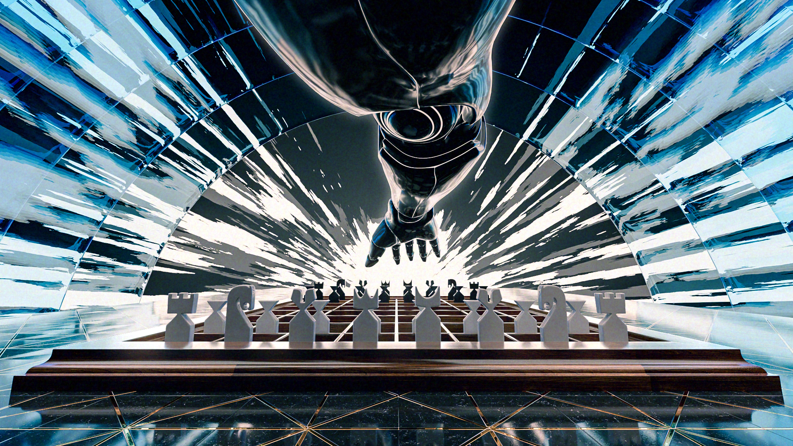

> 封面是笔者的业余作品

# 项目介绍 Intro
这是“虎书”——《Fundamentals Of Computer Graphics》（第五版）的中文翻译，同时也是我读这本书时的学习笔记。

> PS：从24年2月末开始，到今天2024.4.30，终于是将本书的翻译完成了。
> 由于本人的知识有限，对于一些章节中无法完全理解的知识，而造成翻译上的错误以及不通顺的文本，在此表示抱歉。未来，在我重新阅读这本书的时候，我会尝试地将它们翻译得更好。

## 快速上手 Quick Start
1. 克隆或者下载本仓库到本地 `git clone https://github.com/NWPU66/Fundamentals-Of-Computer-Graphics-5th-CN.git`。
2. 使用MarkDown阅读器打开。
> 建议使用Obsidian，笔者编写时使用的是Obsidian，这样格式不会错（大概吧）。

## 特性 Features
笔者在翻译时，翻译的精细程度不同，具体而言：
- 对于基础知识，只做选择性翻译，例如：1、2章数学基础，6、7章线性代数，10章数字图像处理。
- 一些数学上较难理解的章节，例如：13章采样、15章曲线、21章隐式建模。笔者翻译得不够理想。
- 另一些笔者知之甚少、不够熟悉的领域内容。笔者可能在翻译时不够准确。
- 其余章节的主要内容都有翻译。其中介绍性文本采取的方案是：机翻加少量修改，而原理性文本（核心原理，如数学公式）则是笔者亲自阅读翻译的。

阅读时推荐：
- 1到14章和基础图形学知识紧密相关
- 而15到23章则是一些进阶知识（如15章曲线、16章动画、17章图形硬件）或是其他相关领域的补充介绍（如18章色彩、19章视觉、23章可视化）。

## 进度 Progress
- [x] Chapter 1 & 2 介绍与数学基础
- [x] Chapter 3 光栅图像
- [x] Chapter 4 光线追踪
- [x] Chapter 5 表面着色
- [x] Chapter 6 & 7 线性代数与变换矩阵    
- [x] Chapter 8 视图
- [x] Chapter 9 图形管线
- [x] Chapter 10 信号处理
- [x] Chapter 11 纹理映射
- [x] Chapter 12 图形数据结构
- [x] Chapter 13 采样
- [x] Chapter 14 PBR：基于物理的渲染
- [x] Chapter 15 曲线
- [x] Chapter 16 计算机动画
- [x] Chapter 17 使用图形硬件
- [x] Chapter 18 色彩
- [x] Chapter 19 视觉感知
- [x] Chapter 20 色调重构
- [x] Chapter 21 隐式建模
- [x] Chapter 22 游戏中的计算机图形学
- [x] Chapter 23 可视化
